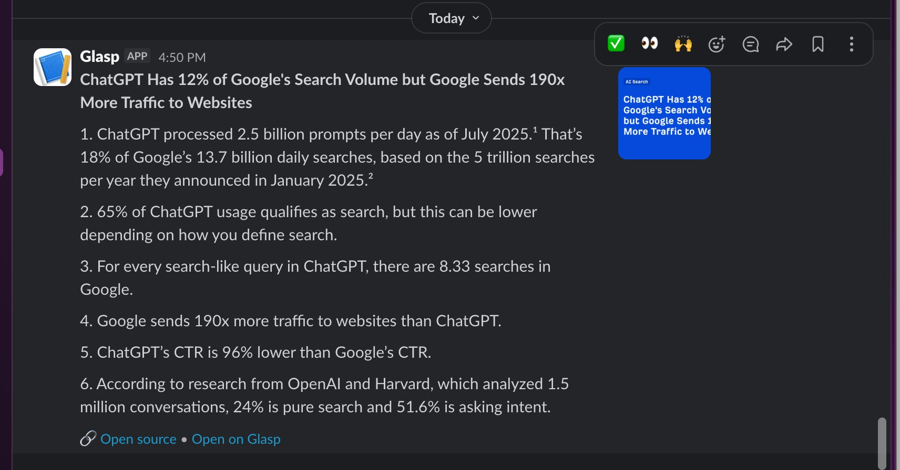

# Glasp Export

Automatically export your [Glasp](https://glasp.co) highlights to your favorite tools using GitHub Actions. No server required — just set up once and it runs on a schedule.

## Supported Destinations

| Destination | Status | Guide |
|---|---|---|
| Slack | ✅ Available | [Setup →](#slack) |
| Notion | 🔜 Coming soon | — |
| Airtable | 🔜 Coming soon | — |
| Google Sheets | 🔜 Coming soon | — |

> Want a destination added? [Open an issue](../../issues) and let us know!

---

## Quick Start

### 1. Create your repo from this template

Click the green **"Use this template"** button at the top of this page, then select **"Create a new repository"**. We recommend making it **private**.

### 2. Add your Glasp Access Token

1. Go to [glasp.co](https://glasp.co) and sign in
2. Open **Settings** → **Access Token**
3. Copy the token
4. In your new repo, go to **Settings** → **Secrets and variables** → **Actions** → **New repository secret**
5. Name: `GLASP_ACCESS_TOKEN` / Value: your token

### 3. Set up a destination

Follow the guide for the destination(s) you want below. You can enable multiple destinations at the same time.

---

## Destinations

### Slack

Send new highlights to a Slack channel with rich formatting and thumbnails.



#### Setup

1. Go to [api.slack.com/apps](https://api.slack.com/apps) and create a new app (or use an existing one)
2. Enable **Incoming Webhooks**
3. Click **"Add New Webhook to Workspace"** and select a channel
4. Copy the webhook URL
5. Add a repository secret: Name: `SLACK_WEBHOOK_URL` / Value: your webhook URL
6. Go to **Actions** → **Glasp → Slack** → **Run workflow** to test

The workflow runs daily at 09:00 UTC by default.

#### Configuration

Edit `.github/workflows/glasp_to_slack.yml` to customize:

**Schedule:**

```yaml
schedule:
  - cron: "0 9 * * *"    # Daily at 09:00 UTC (default)
  - cron: "0 9 * * 1"    # Every Monday at 09:00 UTC
  - cron: "0 */6 * * *"  # Every 6 hours
```

**Options** (uncomment in the workflow file):

| Variable | Default | Description |
|---|---|---|
| `LOOKBACK_HOURS` | `24` | How far back to fetch highlights |
| `MAX_DOCS` | `5` | Max documents posted per run |
| `MAX_HIGHLIGHTS_PER_DOC` | `10` | Max highlights shown per document |

> **Tip:** If you change the cron schedule, set `LOOKBACK_HOURS` to match. For example, every 6 hours → `LOOKBACK_HOURS: "6"`.

---

## Project Structure

```
├── .github/workflows/
│   └── glasp_to_slack.yml      # Slack workflow
├── scripts/
│   ├── glasp_export.py         # Shared: Glasp API client (used by all destinations)
│   └── glasp_to_slack.py       # Slack: formatting + posting
├── docs/
│   └── slack-example.png
├── LICENSE
└── README.md
```

## Troubleshooting

**Workflow runs but posts nothing** — Check that `LOOKBACK_HOURS` covers the period since your last highlight. Try increasing it or adding a new highlight in Glasp and re-running.

**401 Unauthorized** — Your `GLASP_ACCESS_TOKEN` may be expired. Generate a new one in Glasp Settings.

**Slack error** — Verify the webhook URL is correct and the Slack app is still installed in your workspace.

## License

MIT
